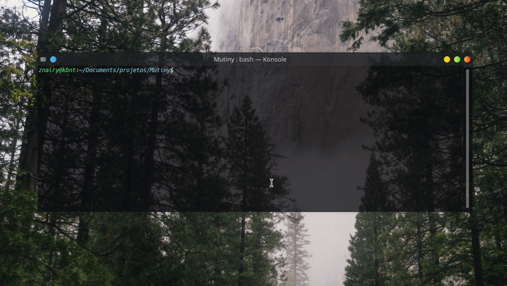
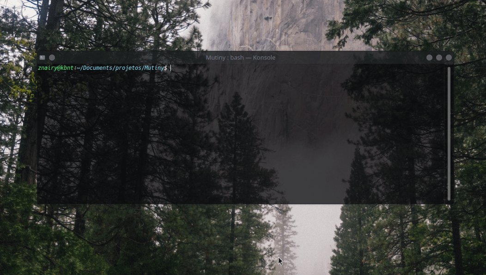

<h1 align='center'><i>Mutiny</i>, simple command line chat in Python.<br></h1>

## Sobre
<p align='center'> O projeto Mutiny é um chat em tempo real, desenvolvido com o intuíto de levar as características de uma "interface" retro, como retratado em muitos filmes e séries dos anos 80/90. Foi inspirado propositalmente em um série que gosto bastante, chamada <a target='_blank' href="https://pt.wikipedia.org/wiki/Halt_and_Catch_Fire_(s%C3%A9rie_de_televis%C3%A3o)"> Halt and catch fire</a>, onde existe uma empresa de jogos virtuais chamada Mutiny e uma das suas aplicações é um chat para sua comunidade.
O projeto foi pensado inicialmente no começo da produção de um TCC quando estava fazendo um curso de informática, que por fim não consegui concluir mas depois de um tempo decidi tirá-lo do papel. O mesmo já passou por algumas versões não definitivas, então pensei em recriá-lo e compartilhar com o público.</p>

## Instalação
Primeiramente clone o repositório usando
```bash
git clone https://github.com/zNairy/Mutiny/
```
Em seguida instale os recursos necessários em <b>dependencies/requirements</b> para execução utilizando o pip de acordo com sua versão do Python.
```bash
python -m pip install -r dependencies/requirements.txt
```
<br>

## Como usar
Inicie o lado servidor (<b>munityServer</b>) para suportar cada cliente que se conecta à ele. Por padrão, tanto o servidor quanto cada cliente é conectado no endereço <tt>localhost:5000</tt> se nenhum argumento for passado em sua instância.
```bash
python mutinyServer.py
```



```python
server = Server() # Server('127.0.0.1', 1010)
server.run()
```

Depois inicie simulando cada cliente executando o <b>munityClient</b>, informando seu nome de usuário posteriormente.


<br>Por padrão os perfis de usuários utilizados ficarão salvos em <tt>.client/profiles</tt>. O mesmo acontece no lado servidor quando um usuário tem êxito ao se conectar, residindo em <tt>.server/registeredUsers</tt><br>

<br>

## Algumas funcionalidades | Observações
- O programa conta com uma variedade de comandos para interação com o usuário. Veja uma lista com os comandos possíveis rodando [/commands](./img/commands.gif).
- Comandos que não tem uma acão direta poderá retornar um exemplo de como se [utilizá-lo](./img/infocommands.gif).
- Alguns dos comandos para interagir com outros usuários no privado são: <tt>/<b>private</b></tt>, <tt>/<b>accept</b></tt>, <tt>/<b>decline</b></tt>, <tt>/<b>unvite</b></tt> e <tt>/<b>leave</b></tt>.
- Você pode mudar a cor do seu nickname usando <tt>/<b>namecolor</b> cor_desejada</tt>
- Cada usuário quando logado recebe um <b>identificador</b> gerado pelo servidor, de modo que cada um seja único e não possa acessar outro usuário apenas informando seu nickname.
- Como dito anteriormente, os perfis de usuários ficam salvos em <tt>.client/profiles</tt>. Se um perfil for alterado, não conseguirá mais logar no servidor visto que seu nickname e identificador são verificados à cada nova seção. Esse sistema foi implementado por fins práticos à de se usar uma senha, sendo mais simples e atingindo a ideia original do projeto.
- Os usuários cadastrados no servidor se mantém mesmo quando o servidor está offline, mas os convites enviados entre os usuários não.
- O arquivo [treeModel](./model/treeModel) mostra a estrutura do programa, entre suas funcões, comandos e utilidades do sistema divididos.
<br>
<br>

## Objetivo | observações
- O projeto não tem por finalidade ser muito complexo, apenas apresentar a ideia original.
- As implementações feitas foram simples, caso queira contribuir implementando opções avançadas como banco de dados, segurança na camada de envio de mensagens como SSL entre outros, abra um pull request ou dê sugestões entrando em contato comigo no <a target='_blank' href='https://discord.com'>Discord</a>.
- No que diz respeito à interface, o chat ainda precisa de uma melhoria por usar a principal funcionalidade para entrada e saída de dados. A entrada no input do terminal faz com que se alguma outra pessoa enviar uma mensagem ela seja "sobreescrita", o que mantém a informação salva mas visualmente não agrada muito. Uma interface gráfica mantendo o estilo de um terminal, mas separando cada área para visualização e entrada das mensagens seria o ideal. (em versões futuras)